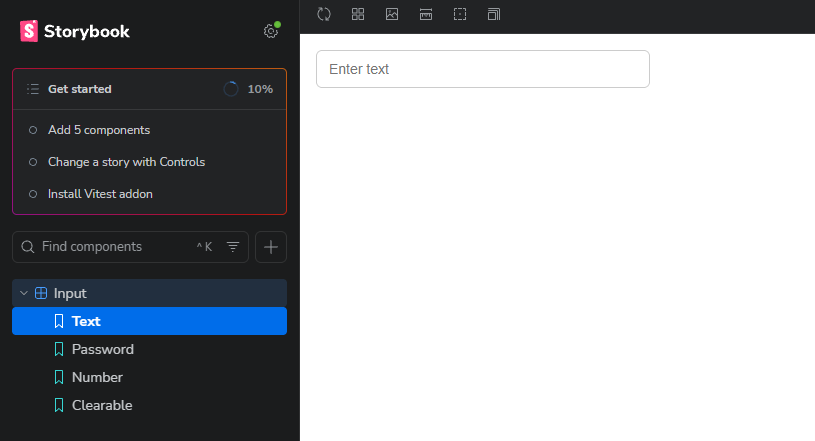
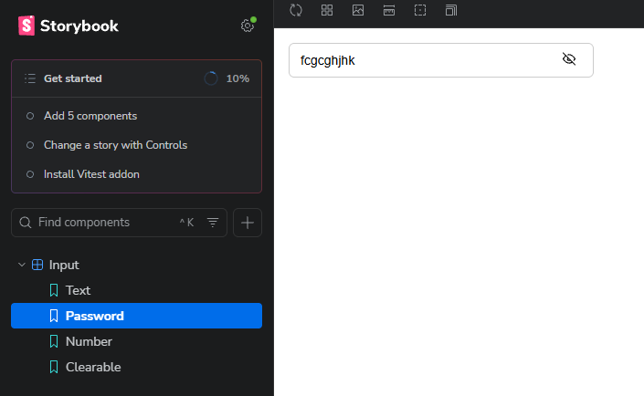
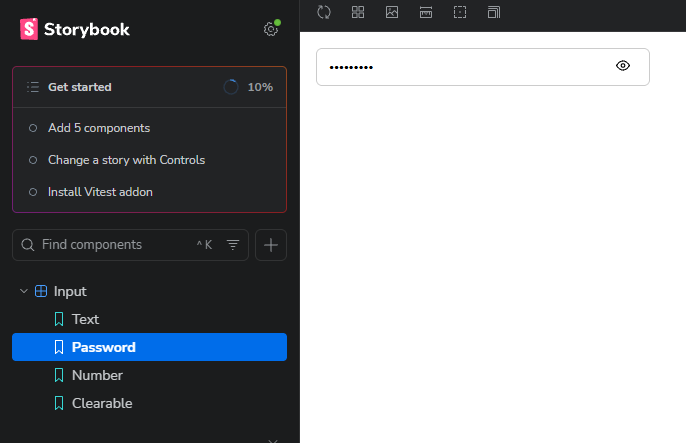
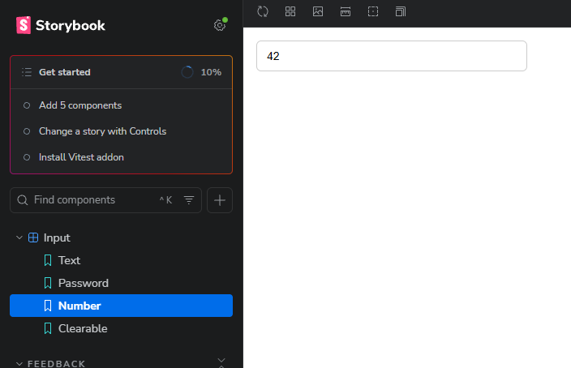
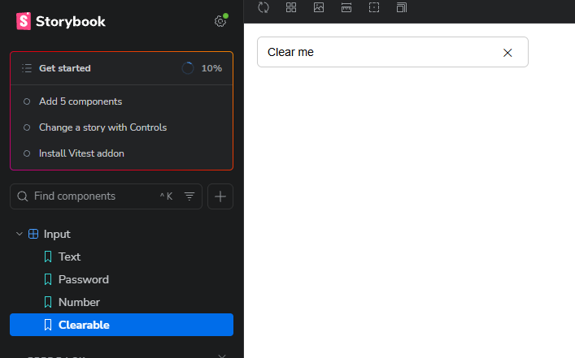
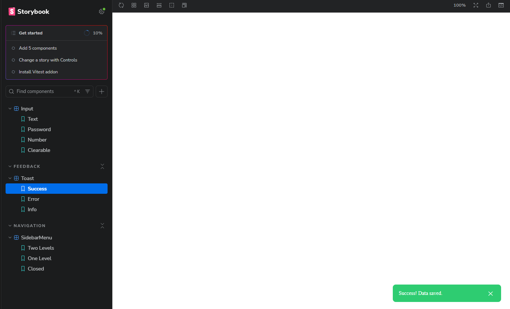
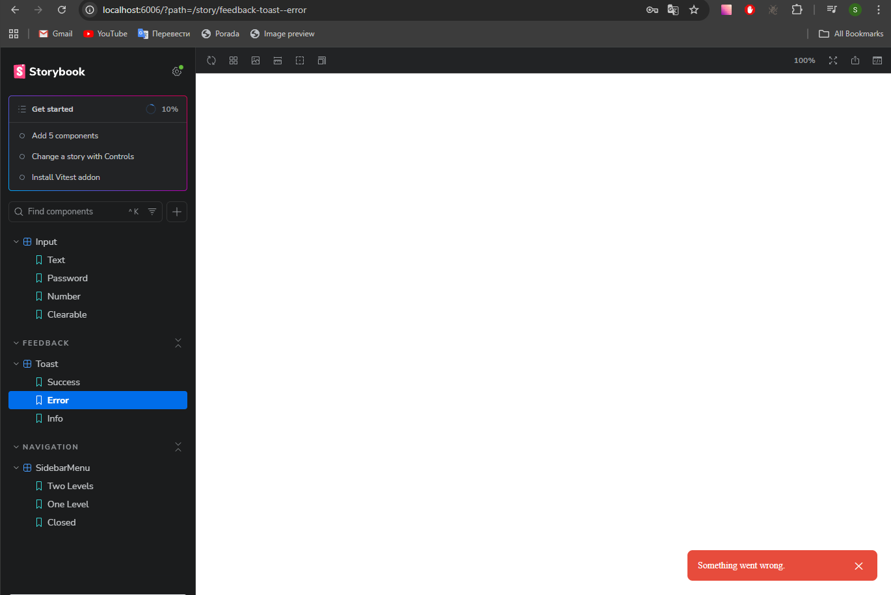
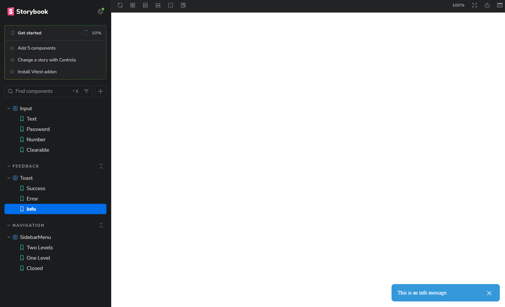
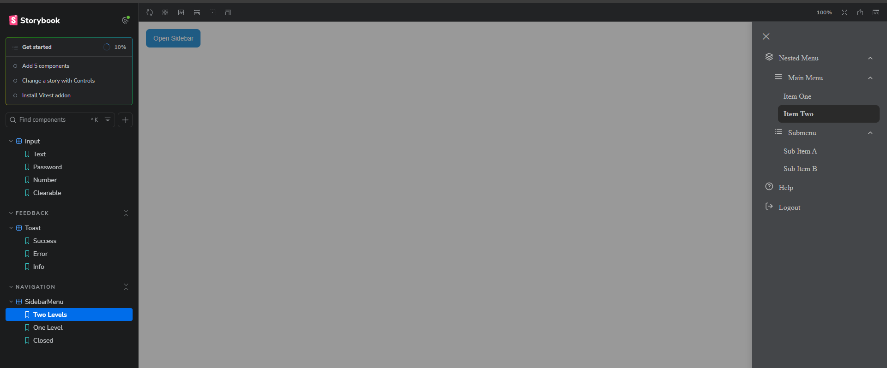

React Component Library (Test Assignment)
A small React UI component library built with TypeScript and Storybook as part of a front-end test assessment.

Tech Stack

- React
- TypeScript
- Storybook
- Framer Motion
- CSS Modules
- Vite

Installation
npm install
npm run storybook

Storybook will be available at http://localhost:6006

omponents Overview

1. Input Component
   Reusable input component supporting multiple types and features:
   text / number / password
   password visibility toggle
   clearable input
   States
   Default
   Password (hidden / visible)
   Clearable

Screenshots:

2. Toast Component
   Notification component with animations and auto-dismiss behavior.

Features
Appears in bottom-right corner
Auto close with configurable duration
Manual close option
Animated transitions

Screenshots:

3. Sidebar Menu Component
   Sliding sidebar menu with nested accordion navigation.

Features
Slides in from the right
Overlay click to close
Nested menu (accordion)
Supports multiple nesting levels

Screenshots:

